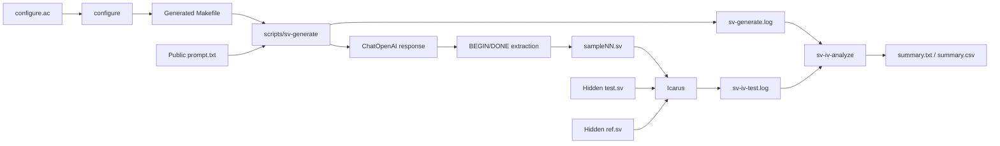
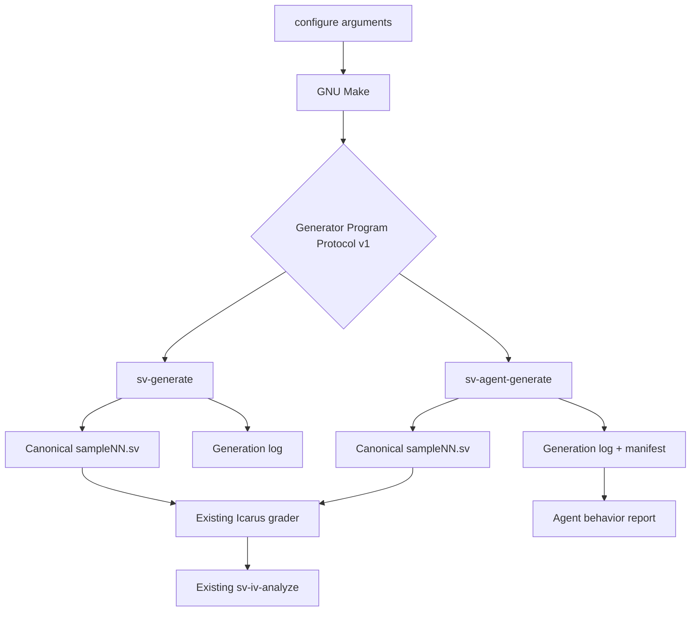
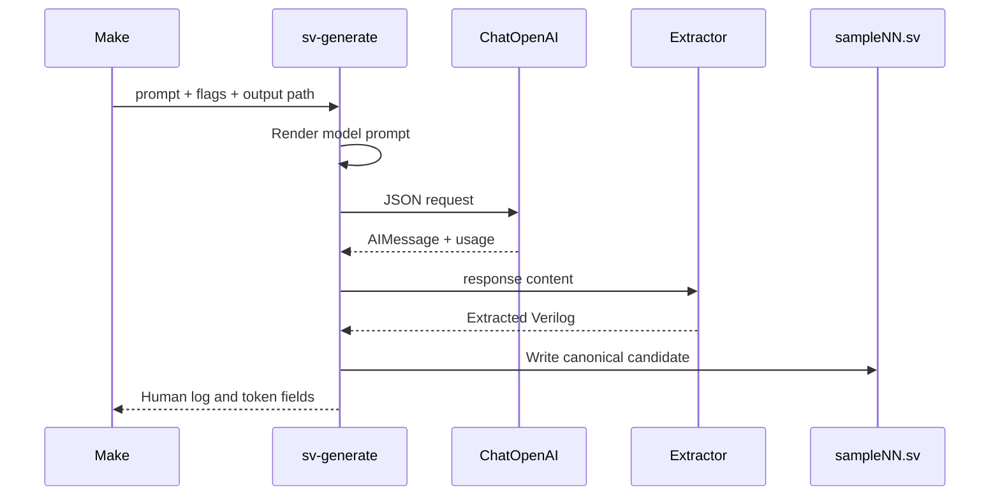
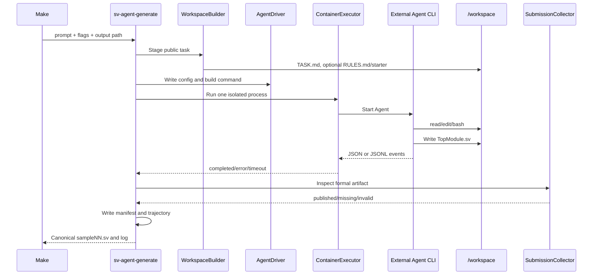

# Agent Evaluation Clean-Room Design

Status: implemented; unit, real-Agent, isolation, timeout, and reporting gates passed

Implementation branch: `agent-eval-v2`

Companion implementation plan: [`../plans/agent-generator-protocol-v1.md`](../plans/agent-generator-protocol-v1.md)

## 1. Source boundary

This design is derived only from the externally observable pipeline in the
current branch:

- `configure.ac` selects benchmark parameters and produces `Makefile`.
- `Makefile.in` invokes one generator program per sample.
- `scripts/sv-generate` turns one public prompt into one `*.sv` candidate.
- Icarus compiles the candidate with hidden `*_test.sv` and `*_ref.sv` files.
- `scripts/sv-iv-analyze` reads generation/test logs and writes canonical
  correctness summaries.

The retired pre-clean-room Agent implementation and its documentation were not
design inputs. They were removed only after the new implementation passed its
contract, real-Agent, isolation, timeout, and reporting integration gates.

## 2. Accepted architectural decision

Model and Agent generation share a **Generator Program Protocol**, not a Python
backend base class.

```text
scripts/sv-generate        # model producer
scripts/sv-agent-generate  # Agent producer
```

The two programs may use completely different internal representations. Their
common downstream artifact is the SystemVerilog file named by `--output`.

### Figure 1 — Current benchmark context (L0)



### Figure 2 — Target producer boundary (L1)



## 3. Module boundaries

| Module | Owns | Must not own |
| --- | --- | --- |
| `configure` and Make | Selection, sample expansion, parallel scheduling | Agent process lifecycle or correctness policy |
| `sv-generate` | Model request and response-to-SV extraction | Agent workspaces or hidden grading |
| `sv-agent-generate` | One Agent invocation for one sample | Problem-set scheduling or hidden grading |
| `agent_generation` | Workspace, container, driver, submission, manifest | Model response extraction or Icarus correctness |
| Icarus and `sv-iv-analyze` | Canonical RTL correctness | Agent orchestration or chat interpretation |

There is one benchmark orchestrator: `configure` plus GNU Make. No second Python
runner may duplicate problem selection, sample expansion, concurrency, or the
Icarus stage.

## 4. Generator Program Protocol v1

### 4.1 Invocation

A conforming producer accepts the existing common arguments:

```text
--task
--model
--examples
--rules
--max-tokens
--temperature
--top-p
--output
prompt_filename
```

The Agent producer additionally accepts bounded Agent controls:

```text
--agent
--agent-timeout
--agent-max-turns
--agent-max-tool-calls
--agent-tool-profile
```

Example:

```sh
scripts/sv-agent-generate \
  --agent=opencode \
  --model=qwen3.6-coder \
  --task=spec-to-rtl \
  --agent-timeout=300 \
  --agent-max-turns=20 \
  --output=Prob001_zero_sample01.sv \
  Prob001_zero_prompt.txt
```

### 4.2 Public input

Only these benchmark inputs may be staged for the Agent:

- The selected public prompt.
- The public interface starter for `code-complete-iccad2023`.
- Rules explicitly enabled by the run configuration.
- Examples explicitly enabled by the run configuration.
- A fixed artifact-submission contract.

The Agent runtime must not receive a dataset directory, reference implementation,
hidden testbench, another sample directory, prior summary, or prior grading log.

### 4.3 Canonical outputs

The mandatory output is the path supplied by `--output`:

```text
<problem>_sampleNN.sv
```

The producer also emits a human-readable generation log through stdout/stderr.
The Agent producer writes structured sidecars derived from the output stem:

```text
<problem>_sampleNN-generation.json
<problem>_sampleNN-trajectory.jsonl
<problem>_sampleNN-stderr.log
```

The generation log preserves the fields consumed by the current analyzer:

```text
prompt_tokens = 123
resp_tokens   = 456
total_tokens  = 579
cost          = 0.0
```

Unknown usage is represented as `null` in JSON, never as a fabricated zero.

### 4.4 Exit semantics

| Outcome | Exit code | Candidate path |
| --- | ---: | --- |
| Candidate published | `0` | Candidate SV |
| Per-sample timeout/error/no submission | `0` | Deterministic invalid placeholder |
| Invalid command-line/configuration | `2` | Not required |
| Harness infrastructure failure before a sample can run | `3` | Not required |

Per-sample failures return zero after publishing a placeholder so Make can keep
the full benchmark denominator. Infrastructure errors fail fast.

## 5. Model producer

The current model producer already normalizes its internal response to an SV
file. `AIMessage` and JSON are intermediate forms, not downstream contracts.

### Figure 3 — Model sequence (L2)



The Agent producer must not copy the model producer's `[BEGIN]/[DONE]`
extraction. Its formal submission is a workspace artifact.

## 6. Agent producer

### 6.1 Formal submission

The fixed formal path inside every Agent container is:

```text
/workspace/TopModule.sv
```

Agent chat text and final-answer Markdown are diagnostic data only. Correct code
in chat with no file is `missing_submission`.

### Figure 4 — Agent sequence (L2)



### 6.2 Internal contracts

```python
@dataclass(frozen=True)
class AgentRunRequest:
    sample_id: str
    agent_name: str
    model: str
    task: str
    prompt_text: str
    rules_text: str | None
    workspace: Path
    timeout_seconds: int
    max_turns: int
    max_tool_calls: int
    max_input_tokens: int
    per_call_max_tokens: int
```

`AgentRunRequest` must not contain dataset, reference, testbench, build-directory,
or grader paths.

```python
class AgentDriver(Protocol):
    @property
    def profile_id(self) -> str: ...
    def write_config(self, request: AgentRunRequest) -> tuple[Path, ...]: ...
    def build_command(self, request: AgentRunRequest) -> tuple[str, ...]: ...
    def parse_event(self, line: str) -> AgentEvent | None: ...
```

Drivers translate only external-CLI differences. Pi and OpenCode both place the
already-staged public prompt text inline using the same initial-request template, so
task visibility does not depend on a first `read` tool call; this duplicates no hidden
content. Drivers do not select a candidate, invoke Icarus, or retry after grading.

```python
@dataclass(frozen=True)
class ContainerSpec:
    image: str
    command: tuple[str, ...]
    workspace: Path
    agent_tools: Path
    timeout_seconds: int
    max_turns: int
    max_tool_calls: int
    environment: dict[str, str]

@dataclass(frozen=True)
class ProcessResult:
    status: Literal["completed", "timeout", "error"]
    exit_code: int | None
    duration_seconds: float
    stdout: str
    stderr: str
    termination_reason: Literal["timeout", "max_turns", "max_tool_calls"] | None
```

```python
@dataclass(frozen=True)
class SubmissionResult:
    status: Literal["published", "missing", "invalid"]
    output_path: Path
    sha256: str | None
    size_bytes: int | None
```

Submission validation is structural only: regular file, no symlink, contained
path, bounded size, and changed starter when applicable. Icarus remains the only
semantic correctness authority.

## 7. Workspace and isolation

Each sample receives a fresh workspace containing only public task material and
Agent-local runtime state:

```text
<work-root>/<run-id>/<sample-id>/
├── TASK.md
├── RULES.md                 # only when enabled
├── TopModule.sv             # absent initially for spec-to-rtl
├── .agent-config/
├── .cache/
└── tmp/
```

The formal runtime uses one Docker container per sample. The host streams
machine events, counts completed turns/tools, and force-removes a container at
its configured budget or wall deadline. A non-Docker executor is allowed only
in unit tests with a fake Agent.

### Figure 5 — Isolation boundary and driver insertion (L3)

```mermaid
flowchart LR
    subgraph HOST[Trusted host]
        GEN[sv-agent-generate]
        DATA[Benchmark dataset]
        HIDDEN[ref.sv and test.sv]
        GRADER[Icarus]
    end

    subgraph BOX[Single-sample container]
        DRIVER[Agent-specific config]
        CLI[Pi, OpenCode, or future CLI]
        WORK[/workspace RW]
        TOOLS[/agent-tools RO]
        ROOT[Read-only root filesystem]
    end

    DATA -->|Copy public prompt/interface only| GEN
    GEN --> WORK
    GEN --> DRIVER
    DRIVER --> CLI
    CLI --> WORK
    CLI --> TOOLS
    ROOT --> CLI
    WORK -->|TopModule.sv only| GEN
    GEN --> GRADER
    HIDDEN --> GRADER
    HIDDEN -. Never mounted .-> BOX
    DATA -. Never mounted as a directory .-> BOX
```

Formal container controls:

- Read-only root filesystem and read-only Agent tool mount.
- `/workspace` as the only primary writable mount.
- Non-root UID/GID, all capabilities dropped, `no-new-privileges`.
- No Docker socket and no repository or build-directory mount.
- Timeout cleanup must kill/remove the entire container before publication.

Secrets must not be copied into workspace artifacts or logs. Local provider
credentials are injected only into the Agent process environment/config and are
redacted from persisted command metadata.

## 8. Configure and Make integration

New configuration parameters:

```text
--with-generator=model|agent
--with-agent=pi|opencode
--with-agent-timeout=300
--with-agent-max-turns=20
--with-agent-max-tool-calls=50
--with-agent-tool-profile=base|rtl
```

Make selects one executable while retaining its existing per-sample DAG:

```make
ifeq ($(generator),model)
  GENERATE_VERILOG := $(scripts_dir)/sv-generate
else
  GENERATE_VERILOG := $(scripts_dir)/sv-agent-generate
endif
```

One formal run has one producer profile. Pi, OpenCode, and model-only runs use
separate configuration/build directories and summaries.

## 9. Structured manifest and reporting

The Agent producer writes one manifest per sample:

```json
{
  "schema_version": "agent-generation/v1",
  "sample_id": "Prob001_zero_sample01",
  "producer": {
    "kind": "agent",
    "agent": "opencode",
    "profile": "opencode-inline-artifact-thinking-v1",
    "model": "qwen3.6-coder"
  },
  "execution": {
    "status": "completed",
    "exit_code": 0,
    "duration_seconds": 24.8
  },
  "submission": {
    "status": "published",
    "sha256": "...",
    "size_bytes": 247
  },
  "usage": {
    "input_tokens": 8200,
    "output_tokens": 1800,
    "turns": 4,
    "tool_calls": 7,
    "usage_source": "trajectory"
  }
}
```

Canonical `summary.txt` and `summary.csv` remain correctness-only outputs.
`scripts/sv-agent-analyze` joins them with manifests into
`agent-summary.json`/`agent-summary.txt`. Correctness, execution, and submission
remain separate. The report includes conditional correctness, turns, tool
calls, duration, and nullable token usage; unknown usage remains null.

## 10. Acceptance gates

1. Fake model and fake Agent producers both satisfy the same output-file/log
   protocol.
2. Chat-only code with no `TopModule.sv` is a missing submission.
3. A timeout preserves a structurally valid candidate written before the
   deadline while retaining `execution.status=timeout`.
4. A sandbox test proves reference/test sentinel files are not visible.
5. The current model-only one-problem generation and Icarus path do not regress.
