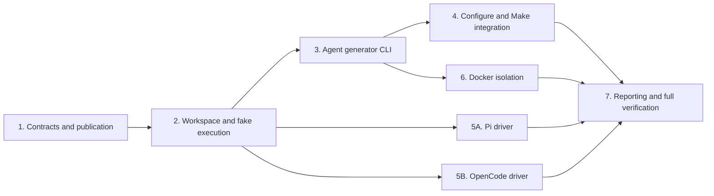

# Construction Plan: Generator Program Protocol v1

Objective: add clean-room Agent evaluation to the current branch while keeping
the existing model producer and Icarus correctness path authoritative.

Design specification: [`../docs/agent-generator-protocol-v1.md`](../docs/agent-generator-protocol-v1.md)

## Fixed invariants

- Model and Agent producers share a process/file protocol, not a backend class.
- The formal Agent submission is `/workspace/TopModule.sv`; chat text is never
  converted into a candidate.
- `*_ref.sv` and `*_test.sv` are never staged or mounted for the Agent.
- `configure` plus GNU Make remains the only benchmark orchestrator.
- Existing `agent_eval/` code is not imported, copied, or adapted.
- Canonical correctness continues through the current Icarus and
  `scripts/sv-iv-analyze` path.

## Dependency graph



Steps 5A and 5B can run in parallel after the driver contract is fixed. Reporting
schema tests can also begin after Step 3, but final integration waits for Steps
4–6.

## Step 1 — Contracts and candidate publication

### Context

The current Make rule supplies a public prompt and `--output` path and expects a
candidate file plus stdout generation log. The new implementation starts with
pure types and publication rules, without invoking a real Agent or container.

### Files

```text
agent_generation/__init__.py
agent_generation/contracts.py
agent_generation/submission.py
tests/test_agent_generation_contract.py
```

### Tasks

- Define immutable request, execution, usage, and submission records.
- Validate positive budgets and supported task names.
- Publish only regular, non-symlink files contained by the workspace.
- Detect missing/unchanged/oversized candidates.
- Use an atomic temporary-file replacement for the final sample path.

### Verification

```sh
python3 -m unittest tests/test_agent_generation_contract.py -v
python3 -m coverage run -m unittest tests/test_agent_generation_contract.py
python3 -m coverage report --fail-under=80
```

### Exit criteria

All contract/publication tests pass with at least 80% line coverage. No module
imports anything from `agent_eval`.

### Rollback

Remove `agent_generation/` and its new test; no current pipeline file changes in
this step.

## Step 2 — Public workspace and fake execution lifecycle

### Context

A per-sample workspace must contain only selected public inputs and must be
cleaned after publication. A fake executor allows lifecycle tests without
running an untrusted process on the host.

### Files

```text
agent_generation/workspace.py
agent_generation/execution.py
tests/test_agent_workspace.py
tests/fixtures/fake_agent.py
```

### Tasks

- Stage `TASK.md`, optional `RULES.md`, and a public interface starter.
- Track starter digest for code-completion submission detection.
- Define executor and process-result protocols.
- Test completion, missing submission, timeout-with-candidate, and cleanup.
- Prove path traversal/symlink candidates are rejected.

### Verification

```sh
python3 -m unittest tests/test_agent_workspace.py -v
python3 -m unittest discover -s tests -v
```

### Exit criteria

Every test uses a fresh temporary directory; no dataset directory is exposed in
an execution request.

### Rollback

Revert Step 2 files; Step 1 remains independently usable.

## Step 3 — Agent generator CLI vertical slice

### Context

`scripts/sv-agent-generate` must implement the current Make generator process
contract for one sample. It initially accepts a dependency-injected fake driver
in tests; no real external Agent is required for the first integration gate.

### Files

```text
agent_generation/cli.py
agent_generation/manifest.py
agent_generation/drivers/base.py
scripts/sv-agent-generate
tests/test_sv_agent_generate.py
```

### Tasks

- Parse common generator flags plus Agent budgets.
- Build one workspace, run one executor, collect one candidate, and clean up.
- Write deterministic placeholders for per-sample failures.
- Write generation JSON, trajectory JSONL, stderr, and compatible token lines.
- Redact credential-like environment values from persisted command metadata.

### Verification

```sh
python3 -m unittest tests/test_sv_agent_generate.py -v
python3 scripts/sv-agent-generate --help
```

### Exit criteria

A fake Agent creates a candidate that can be compiled by Icarus; chat-only output
produces `missing_submission` and does not become SV.

### Rollback

Remove the CLI and Step 3 modules; Make has not selected them yet.

## Step 4 — Configure and Make integration

### Context

The generated Makefile remains the sole scheduler. It selects either
`sv-generate` or `sv-agent-generate` and passes one profile's flags to every
sample target.

### Files

```text
configure.ac
configure
Makefile.in
flake.nix
tests/test_agent_configure.py
```

### Tasks

- Add and validate generator/Agent configure options.
- Generate a Makefile with exactly one selected producer.
- Add Agent sidecars to pre-generated artifacts without changing grader inputs.
- Include all Agent options in Nix build-directory hashing.
- Keep model defaults and model-only command lines unchanged.

### Verification

```sh
python3 -m unittest tests/test_agent_configure.py -v
nix flake check --all-systems --no-build "path:$PWD"
bash -n configure
```

### Exit criteria

Generated model Makefiles use `scripts/sv-generate`; generated Agent Makefiles
use `scripts/sv-agent-generate`. One fake-Agent sample reaches the current
Icarus rule.

### Rollback

Revert the five integration files; Steps 1–3 remain isolated.

## Step 5 — External Agent drivers

### Context

Drivers translate external CLI configuration, command, and JSON event formats.
They must not own workspace content, submission selection, process isolation, or
grading.

### Files

```text
agent_generation/drivers/pi.py
agent_generation/drivers/opencode.py
tests/test_agent_drivers.py
```

### Tasks

- Implement minimal provider configuration for each pinned external CLI.
- Build argv arrays without shell interpolation.
- Parse events into nullable normalized usage/turn/tool metrics.
- Version each driver profile and record the exact CLI version.
- Reject unsupported model/profile combinations before sample execution.

### Verification

```sh
python3 -m unittest tests/test_agent_drivers.py -v
```

### Exit criteria

Fixture trajectories normalize deterministically, malformed lines are counted,
and no credential value appears in a generated manifest.

### Rollback

Remove one driver independently; the other driver and fake driver continue to
work.

## Step 6 — Formal Docker isolation

### Context

The formal executor runs one container per sample. It receives only a writable
workspace, read-only Agent tools, and the fixed runtime image. The repository,
build directory, hidden dataset, and Docker socket are absent.

### Files

```text
agent_generation/docker.py
flake.nix
tests/test_agent_docker.py
```

### Tasks

- Build Docker argv with read-only root, non-root identity, dropped capabilities,
  `no-new-privileges`, PID/resource limits, and explicit mounts.
- Use a unique cidfile and force-remove the container after timeout.
- Verify candidate snapshot happens only after process termination.
- Add a sentinel integration test proving hidden files are unavailable.
- Record image identity/digest in every manifest.

### Verification

```sh
python3 -m unittest tests/test_agent_docker.py -v
nix flake check --all-systems --no-build "path:$PWD"
```

### Exit criteria

The Docker command contains no repository/dataset/build mount, timeout cleanup
is tested, and a real one-problem smoke cannot read hidden sentinels.

### Rollback

Disable the Agent flake app and remove Docker executor files; model evaluation
remains available.

## Step 7 — Reporting, adversarial review, and benchmark gates

### Context

Canonical Verilog correctness and Agent operational status remain orthogonal.
A secondary report joins canonical summaries with generation manifests.

### Files

```text
scripts/sv-agent-analyze
agent_generation/report.py
tests/test_agent_report.py
docs/agent-generator-protocol-v1.md
```

### Tasks

- Report unconditional Pass@1, submission/timeout/error rates, conditional pass,
  turns, tools, tokens, duration, and cost per success.
- Treat unknown usage as unknown, not zero.
- Run an adversarial review for hidden-data leaks, retries, transcript extraction,
  stale workspace reuse, and status conflation.
- Run one fake, one Pi, and one OpenCode one-problem smoke before a larger set.
- Compare model-only output and grading against the pre-change baseline.

### Verification

```sh
python3 -m unittest discover -v
python3 -m coverage run -m unittest discover
python3 -m coverage report --fail-under=80
nix flake check --all-systems --no-build "path:$PWD"
git diff --check
```

### Exit criteria

All tests pass, changed Python modules have at least 80% coverage, hidden-data
sentinels remain inaccessible, and canonical summaries remain grader-derived.

### Rollback

Reporting can be removed without affecting generation or canonical grading.

## Adversarial review checklist

Before a formal run, answer all of these with file/test evidence:

- Can any Agent command or mount name the repository, dataset, reference, or
  hidden test path?
- Can stdout/chat code become a candidate without `TopModule.sv`?
- Can an Agent receive hidden grading output and retry within the same sample?
- Can timeout leave a process/container running after candidate publication?
- Can unknown token usage, missing submission, or timeout be reported as a clean
  completion?

Any `yes` blocks the formal benchmark.

## Anti-patterns

- A second all-problem Python runner beside Make.
- A common backend base class that forces model response semantics onto Agents.
- Regex extraction from an Agent's final chat response.
- Mounting the build or dataset directory to simplify path handling.
- Combining operational Agent status with Icarus correctness into one field.

## Plan mutation protocol

When implementation evidence invalidates a step:

1. Record the failed assumption under that step.
2. Add or split a step rather than silently expanding scope.
3. Update dependency edges and verification commands.
4. Preserve fixed invariants unless the user explicitly changes them.
5. Re-run the adversarial checklist after any isolation or protocol mutation.
