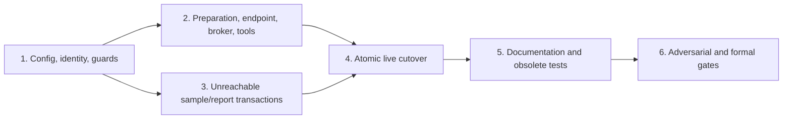

# Blueprint: Deepen the Generator Seam

Status: accepted; implementation authorized by the user

Objective: move Agent configuration, identity, preflight, credential handoff, run orchestration, sample-result commit, and joined reporting behind an Agent-owned module while preserving GNU Make scheduling, the original model producer, and the original Icarus correctness path.

Base branch: `agent-eval-v2`

Fixed starting revision: `245c19918f18abb7e6aa328282f3624afc0e2884`

## Preflight evidence

- Local tracked tree matched `origin/agent-eval-v2`; all 61 Python tests and the no-build Nix flake check passed.
- `origin` is `Ic-arbon/verilog-eval`; `upstream` is `NVlabs/verilog-eval`; no hosted workflows exist.
- Authorized cleanup deleted 67 pre-refactor server build roots (182,063,104 allocated bytes). The empty `build/`, `opencode/`, `.agent-tools/`, source, Git HEAD, and tracked status remain; no Agent container remained.
- Disposable Autoconf→Make prototypes under `/tmp/generator-seam-argv-prototype/` rejected shell-text static args and proved the selected NUL-argv seam. A producer-neutral Python adapter plus `os.execv` preserved ten adversarial model values and an adversarial Agent config path byte-for-byte with zero shell side effects. Tracked tests must reproduce this.

## Fixed invariants

1. Make is the only code path allowed to invoke a generator per sample. Python may enumerate expected identities only for hashing and validation.
2. Hidden tests, Icarus, and `scripts/sv-iv-analyze` remain the correctness authority.
3. `/workspace/TopModule.sv` is the only formal submission; chat/stdout/trajectory is never candidate input.
4. Each sample gets a fresh non-root container. No repository, dataset directory, hidden file, full run config, Docker socket, arbitrary tools prefix, or unrelated environment enters it.
5. Execution, submission, and correctness remain orthogonal.
6. Unknown usage remains `null`/`unavailable`, never zero.
7. Agent tools are explicit and content-addressed. Formal evaluation never installs/downloads them.
8. Normalized trajectory is required; raw transport stdout is not persisted.
9. Agent evaluation defines and sends neither `temperature` nor `top_p`.
10. Core code sees only an OpenAI-compatible endpoint.
11. No new numbered schema/profile/image/document/plan identifier is introduced.
12. `scripts/sv-generate`, its accepted option semantics, and its grader path remain unchanged.
13. Only a classified Agent outcome after successful container launch and confirmed cleanup may enter the denominator. Infrastructure failure never becomes a sample result.
14. Semantic config is canonical JSON, not environment. The API key does not enter configure, Make, grader, or unrelated recipe environments.
15. Every accepted sample and report has an explicit, recoverable linearization point and hash-valid bundle.

## Selected generator interface

Autoconf selects a producer and atomically writes static argv as NUL-separated records in a regular mode-0600 build-local file. Make receives only paths:

```make
GENERATOR_INVOKER   = $(scripts_dir)/sv-invoke-generator
GENERATOR_PROGRAM   = @selected_generator@
GENERATOR_ARGS_FILE = .generator-args

"$(GENERATOR_INVOKER)" \
  --program "$(GENERATOR_PROGRAM)" \
  --args-file "$(GENERATOR_ARGS_FILE)" -- \
  --verbose --output "$@" "$<"
```

The generic adapter validates the program/argument file and calls:

```python
os.execv(program, [program, *static_args, *dynamic_args])
```

Model static argv is the exact legacy sequence. Agent static argv is one token, `--run-config=<absolute path>`. Make parses no producer value. This gives a deep generator **seam** while preserving model **locality** and giving Make high **leverage**.

Adapter bounds match direct `execve`: total argv+environment must fit platform `SC_ARG_MAX` with only the OS-required margin; there is no lower per-token semantic cap. Configure emits the fixed legacy argument count; extra records beyond that producer contract are invalid. The argv filename is fixed/build-relative, and producer choices are fixed allowlisted scripts, so opaque values never enter Make syntax. Source/build/dynamic target paths crossing Make must satisfy an explicitly tested Make-safe locator grammar and fail before configure side effects; model option values remain unrestricted. End-to-end generated-configure→Make→adapter tests cover every model option, empty/leading-dash/newline/metacharacter values, practical ARG_MAX edges, adversarial locators, exact argv, and side-effect canaries. The adapter opens the fixed args file once through a directory fd using `O_NOFOLLOW`, then verifies regular type, expected owner, mode 0600, bounded descriptor read, exact final NUL, exact producer record count, and no empty/malformed record before `execv`; it never reopens by path. Symlink/FIFO/replacement/truncation/empty-record/race tests must fail without execution.

Rejected designs: shell-text args (injection), a model config adapter (scope violation), generated launchers (hidden code/order), and public test-only ports (shallow interface).

## Runner CLI state machine

| Mode | Material inputs | Runtime locators | Jobs | Nonce/recovery |
| --- | --- | --- | --- | --- |
| ordinary | Current Agent `--with-*` inputs or defaults | May be supplied explicitly | Resolve `VERILOG_EVAL_JOBS`; enters identity | No nonce; repeated invocation resolves same run; never selects nonce run |
| `--new-run` | Same as ordinary; mutually exclusive with resume | Same as ordinary | Material | Generate nonce after preflight; publish a durable recovery receipt before attempting stdout acknowledgement |
| `--resume=<config>` | No material CLI overrides/default application | May rebind source/dataset/Docker/tools locators if identities match; immutable run-store root never moves | Load from config; if environment provides jobs it must equal stored value | Resume exactly this config, including nonce if present |

`--new-run` plus `--resume` is invalid. Sampling options are absent and fail before side effects. Material endpoint/model/key-name authoring inputs are explicit (`--with-openai-api-base`, existing `--with-model`, and `--with-api-key-environment`); after parsing they exist only in canonical config. The credential value is read from the named variable, but endpoint semantics are not inherited from `OPENAI_API_BASE` by formal child processes. A pre-config failure has no run identity. After config publication, the runner writes a non-identity recovery receipt under the build-root lifecycle lock containing digest/config path, then prints and flushes the path, then marks the receipt acknowledged. Before another `--new-run`, while holding the build-root lifecycle lock, the runner no-follow scans validated 64-hex roots for canonical nonce configs lacking receipts and synthesizes an unacknowledged receipt; it then replays all unacknowledged receipts and requires `--resume-recovery=<receipt>` or `--abandon-recovery=<receipt>`. A death test targets the exact config-publication/receipt-publication gap, so nonce runs are never silently orphaned. `--list-recoveries` is read-only. Receipts are canonical mode-0600 non-identity records under `<build-root>/.recoveries/`, containing state, config digest/path, and acknowledgement only. Management requires the build-root exclusive lifecycle lock and no-follow validation. Resume marks acknowledged after path replay; abandon quarantines an incomplete run and receipt but refuses a complete valid run. The Step-1 helper handles acknowledged/unacknowledged/temp receipt, socket, and lock remnants across rollback. Death tests cover config publication, receipt publication, each stdout write/flush, and acknowledgement.

The immutable run store is always the parent encoded by the supplied config path; resume cannot relocate it. Only source/dataset/archive/tools locators may rebind by identity. Run-state behavior is closed:

| Existing state | ordinary | `--resume` | `--new-run` |
| --- | --- | --- | --- |
| absent non-nonce | create deterministic run | invalid path | create distinct nonce run |
| partial hash-valid non-nonce | validate then Make resumes missing targets | same | create distinct nonce run |
| complete hash-valid run/report | validate and return without Make | same | create distinct nonce run |
| corrupt run | block and require quarantine | block and require quarantine | blocked until corrupt root/receipt handled |
| nonce run | never selected implicitly | exact resume only | create another distinct nonce run |

Daily operation remains:

```bash
AGENT_EVAL_AGENT_TOOLS="$PWD/.agent-tools" \
VERILOG_EVAL_JOBS=16 \
nix run .#agent-eval -- --with-agent=pi
```

## Canonical run identity

Canonical UTF-8 JSON uses sorted keys/fixed separators and rejects duplicate/unknown authoring keys, NaN, secret values, and locator paths. Exact bytes define:

```text
sha256 = SHA256(run-config.json bytes)
run    = <build-root>/<sha256>/
config = <run>/run-config.json
```

Config publication uses a same-directory `O_EXCL|O_NOFOLLOW` mode-0600 temporary, regular-file verification, file `fsync`, atomic no-replace link/publication, parent-directory `fsync`, then no-follow temp removal/sync. Recovery accepts only exact canonical bytes whose digest equals the parent name under the configured root. Truncated/mismatched occupancy is invalid.

Material identity includes:

- Agent/model/task/samples/examples/rules and every effective benchmark option;
- ordered problem IDs and content hashes for problems file, selected prompts, public starters, selected example/rule text, hidden tests, and hidden references;
- all token/turn/tool/timeout budgets and thinking;
- OpenAI-compatible base URL and API-key environment name;
- clean source commit;
- Docker image ID and daemon identity;
- exact projected Agent-tools content, lock, and dependency versions;
- content/derivation identities for Python, Bash, GNU Make, Icarus, timeout/core tools, Docker client, and all host executables affecting generation/publication/grading/analysis;
- content/derivation identities for every admitted nonsecret support file, including CA bundle, resolver/runtime data, locale data, and tool configuration consulted by those executables;
- jobs and optional nonce.

Mutable external network/model state is classified as external evidence rather than hashable run material; run evidence records endpoint/model and bounded preflight response identity without claiming to freeze remote state.

Absolute source/build/dataset/executable/archive/tools paths are runtime locators; stable content/derivation identities are material. Python may enumerate inputs only to hash/validate them; only Make invokes producers/graders.

## Runtime bindings transport

Machine-local locators are carried in a mode-0600, non-identity `<run>/runtime-bindings.json`. It contains the config digest plus source/dataset/build, Docker daemon/client/archive/image, projected-tools, shell/toolchain, certificate/support-file, and broker locators—never semantic overrides or secret values. The runner publishes it atomically under the run lock immediately before configure, validates every locator against canonical material identities, and removes/syncs it after success or failure. Resume rebuilds it after identity validation. A stale crash remnant is never trusted and is atomically replaced only under the same lock. `sv-agent-generate` derives this fixed sibling path from verified `run-config.json`; Make still passes one config token. Tests cover stale/missing/mismatched bindings, same-config rebind, crash at each publication stage, and proof that the file is never mounted or accepted as evidence.

## Closed host environment

Formal entry uses pinned Python isolated mode (`-I` and safe-path behavior) and an explicit repository entry script. It rejects tracked dirtiness and any untracked/ignored runtime-affecting Python, shell, configure, Make, dataset, `.pth`, customization, executable, or shadow module outside allowlisted external build/cache/tools roots. Tests set `PYTHONDONTWRITEBYTECODE=1` or route bytecode to an external allowlisted cache; Autoconf runs through a tracked regeneration script that removes/relocates `autom4te.cache`. Final formal runs use a fresh clean worktree, bind tools outside it, and run the actual contamination guard after every test/build command and immediately before each evaluation.

Each process gets a separately constructed environment:

- **runner:** pinned `PATH`, locale, certificate path, explicitly allowed run settings, resource locators, and selected credential only;
- **configure:** pinned tools, clean locale, temporary HOME, no credential, no Python/shell startup hooks;
- **Make/recipes/grader:** pinned tools/SHELL/locale only; no credential, `MAKEFLAGS`, `MFLAGS`, `GNUMAKEFLAGS`, `BASH_ENV`, `ENV`, `PYTHON*`, dynamic-loader variables, Node options, proxies, or Docker config;
- **Docker client:** pinned path and explicitly fixed local daemon binding; no ambient Docker/proxy/config variables;
- **Agent adapter/container:** exact driver allowlist plus selected credential name after private retrieval.

Canary tests cover `CONFIG_SITE`, startup hooks, Python paths, loader variables, Node options, Docker variables, locale/proxy controls, and untracked shadow files. Credential names colliding with structural/runtime names are rejected.

## Minimal Agent-tools projection

The arbitrary supplied prefix is never mounted directly. Preparation parses the existing lock file without running npm, determines installed non-development package roots and declared binary links, and builds a private read-only projection for the selected Agent:

- copy regular files into a new projection rather than hard-linking;
- include only lock-declared production package roots and declared binary links required by the selected Agent;
- reject device/FIFO/socket entries, external symlinks, undeclared package roots/binaries, root/package `.npmrc`, environment/key/token files, caches, logs, and unexpected package-manager state;
- validate internal symlinks, modes, ownership, and regular-file bytes;
- hash the exact projected tree and record both source-prefix and projection identities;
- reuse a projection only by exact digest.

Only the projection is mounted read-only as `/agent-tools`. Tests inject `.npmrc`, caches, logs, unsafe symlinks, hard links, extra executable entries, and undeclared packages and prove they do not enter the projection.

## Source-free image proof

The Nix image is built only from an explicit package closure; repository source is not a build context. A tracked image-isolation smoke creates unique canary bytes in repository/public/hidden/config files, builds and saves each OCI image, scans every raw layer tar plus the reconstructed merged filesystem, and fails on any canary or forbidden path. It also validates an allowlisted top-level filesystem inventory and confirms no deleted layer retains forbidden bytes before image ID enters run identity.

## Private credential handoff

The runner uses the credential for preflight, removes it from all child environments, then serves it over a run-local Unix broker. To avoid `AF_UNIX` path limits, broker and client open/chdir/fchdir to the verified run directory and bind/connect using the relative name `.credential.sock`; the run directory is mode 0700 and socket mode 0600.

The broker runs only while the exclusive run lock is held, validates peer UID plus expected config digest/sample ID/environment name, supports configured concurrency, persists/logs nothing, and unlinks on every exit. `sv-agent-generate` retrieves the key into only its process environment and passes it to Docker by name. The socket/config is not mounted. Linux `/proc` and recording tests prove configure, Make, recipes, grader, analysis, argv, and persisted artifacts never receive the value. Long-root tests run on macOS and Linux.

The selected Agent owns credential handling and candidate-content safety after retrieval. Candidate admission is structural only: the evaluator never scans candidate bytes or changes submission status based on their content. Exact credential values are still redacted from diagnostic trajectory/stderr persistence, which is a separate operation and cannot alter the candidate.

## OpenAI-compatible preflight

A short-lived isolated helper process performs resolution, connection, TLS, headers, and body under one parent-enforced monotonic deadline. The credential travels by private pipe, not argv/environment. Timeout kills the helper process group, preventing resolver/TLS worker leakage.

Accepted bases are `https://authority[/unreserved-prefix]/v1[/]` or explicitly allowed loopback `http` with the same grammar; IPv6 authorities must be bracketed, encoded slash/dot ambiguity is rejected, and one trailing slash is normalized away. The request is exactly `<scheme>://<authority>/<preserved-prefix>/v1/models`; status must be 200. Informational responses, userinfo/query/fragment, redirects, proxies, compression, duplicate/ambiguous length framing, unsupported transfer encodings, and continuation are rejected. Raw status line, header count/bytes, chunk count/framing bytes, total wire bytes, decoded body (1 MiB), model entries (10,000), ID length (4 KiB), JSON depth/items, and total work are bounded. Over bounded HTTP/1.1, the response requires `data`; top-level `object` is the only optional ordinary field. The explicit optional pagination fields are `has_more`, `next`, and `next_page`: only false/null/empty no-more values are accepted; every indication of continuation and every unknown pagination-like top-level key is rejected. Bounded per-model metadata is ignored. Exact model ID is required. Tests cover prefix/trailing-slash/IPv6/percent encoding, extra metadata, pagination, stalled DNS, TLS handshake/cert errors, IPv4/IPv6 fallback, redirects, slow chunks, oversized status/headers/body, framing ambiguity, malformed shapes, and orphan-process cleanup.

## Run locks and cleanup

A nonblocking exclusive per-run lock is held from existing-bundle validation through configure, Make, broker shutdown, report publication, and cleanup exclusion. Same-run concurrency fails; nonce runs are independent.

A build-root lifecycle lock closes creation versus rollback: every run/receipt/root publication holds it shared, while rollback/quarantine holds it exclusively. Valid runs are deleted only after config/bundle validation. Invalid/truncated 64-hex roots are never recursively deleted: a Step-1 standalone directory-fd/no-follow helper atomically renames them into `<build-root>/quarantine/` with a random suffix. Symlink/path-traversal cases fail. Rollback uses this helper, not potentially broken Step-4 code, and quarantines every new-format root before source revert.

## Closed failure taxonomy

Only these **sample outcomes** commit a bundle and return success to Make, and only after container launch plus confirmed removal/cleanup:

| Event | Execution | Submission behavior |
| --- | --- | --- |
| Agent exits zero | `completed` | inspect candidate; publish candidate or deterministic invalid placeholder |
| Agent process exits nonzero after valid launch | `error` | preserve valid candidate if present, otherwise placeholder |
| Host wall timeout with successful force-remove | `timeout` | preserve valid candidate if present, otherwise placeholder |
| Host turn/tool budget with successful force-remove | `error` + matching reason | preserve valid candidate if present, otherwise placeholder |
| Unrecognized but nonfatal Agent output lines | process-derived status; usage may be unavailable | never infer candidate from output |

These are **infrastructure failures**: config/input/digest/broker failure; Docker control-plane exit (including prelaunch 125 and command launch 126/127); missing/invalid container identity; executor/driver exception; budget classifier exception; manifest/telemetry contract validation failure; container cleanup/remove failure; credential handoff failure; projection failure; publication/fsync/recovery failure; configure/Make/grader/report failure. They return nonzero and cannot become `execution=error` rows. The failing sample publishes no accepted bundle and the run publishes no completed report; already linearized hash-valid bundles from other parallel targets remain resumable. A parallel Make test commits one target while another suffers infrastructure failure.

Malformed usage is a contract error if structurally claimed; absent telemetry is nullable unavailable. Closed execution rules are: `completed` requires exit 0 and null reason; `timeout` requires exit 124/reason timeout; budget `error` requires the reserved host code and matching reason; ordinary `error` requires nonzero exit and null reason. Submission remains independent. Tests drive every taxonomy row through adapter, Make, bundle validator, and report.

## Sample-result transaction

Prepared artifacts are credential-redacted diagnostic trajectory/stderr, canonical manifest, and a byte-preserved candidate. The manifest hashes/sizes exactly candidate, trajectory, and stderr; it never hashes itself. Manifest integrity is established by canonical-byte parsing plus config/sample structural validation, avoiding circular identity. Sidecars use no-follow directory-fd temp creation, file sync, rename, and directory sync. Candidate rename is the linearization point after durable sidecars; then its directory is synced. Catchable post-rename failures unlink/sync candidate. If cleanup fails, the run is corrupt and quarantinable. Diagnostic redaction and candidate admission are disjoint: no candidate byte is inspected as security policy.

Process death between rename/sync is recovered by validation, never existence. Recovery is deterministic:

| Durable state | Recovery |
| --- | --- |
| no sidecars, no candidate | generate normally |
| validated regular partial/complete sidecars, no candidate | unlink sidecars with directory-fd/no-follow operations, sync directory, then regenerate; never promote |
| suspicious/nonregular/mismatched sidecar, no candidate | quarantine the whole run before Make |
| candidate with missing/mismatched sidecar/config/hash | mark corrupt and quarantine run; Make never starts |
| candidate plus fully hash-valid bundle | accept completion and skip generation |
| invalid-placeholder candidate | accept only exact frozen bytes plus matching missing/invalid manifest status |

Parallel Make targets have disjoint sample paths; a target-local no-follow lock rejects duplicate direct invocation. Child-death tests cover every hook and every table state.

Missing, unchanged starter, symlink, empty, nonregular, or oversized workspace submission produces frozen invalid Verilog and its orthogonal status. Every other bounded regular candidate is published byte-for-byte regardless of content. Pinned-Icarus tests prove placeholder failure for both tasks, and transaction tests prove diagnostic redaction cannot reject or modify a candidate.

## Exact workspace/container projection

Before execution, host-generated files are exactly:

```text
TASK.md
RULES.md                               # only selected
TopModule.sv                           # public starter only for code-complete
.agent-config/<selected-driver files>
```

Driver files may contain only model ID, generic URL, credential-name reference, context/output limits, thinking, permissions/tools, and fixed container-local paths. They contain no run JSON, host path, hidden hash, provenance, job/image/tool identity, or secret value. User-supplied mounts are exactly writable `/workspace` and projected read-only `/agent-tools`; Docker-managed `/etc/hosts`, `/etc/hostname`, and `/etc/resolv.conf` inputs are separately inventoried/validated, carry no forbidden canary, and have admitted support identity recorded where stable. Environment is exact and the container user is explicitly non-root. Post-run nonformal files are discarded.

## Unnumbered result predicate

Required manifest semantics:

| Path | Rule |
| --- | --- |
| `sample_id` | expected safe target ID |
| `producer.kind` | literal `agent` |
| `producer.agent`, `producer.model` | nonempty strings |
| `producer.run_config_sha256` | 64 lowercase hex, common to run |
| `execution.status` | `completed`, `timeout`, `error` |
| `execution.exit_code` | integer or null |
| `execution.duration_seconds` | finite nonnegative number |
| `execution.termination_reason` | null/timeout/max_turns/max_tool_calls, cross-field consistent |
| each limit | positive integer |
| `submission.status` | published/missing/invalid |
| source submission hash/size | required only for published source candidate, otherwise null |
| usage numeric fields | nonnegative integer or null |
| `usage.usage_source` | closed enum `trajectory` or `unavailable`; unavailable requires every usage field null; trajectory permits token fields null only when no explicit token event exists while observed turn/tool counts remain nonnegative |
| required runtime identities | validated nonempty strings/digests |
| candidate/trajectory/stderr artifact hash/size | exact persisted payload bytes; manifest never self-hashes |

Reserved old schema/profile keys are rejected. Bounded additive fields are accepted only after recursive rejection of secret values, host/runtime paths, hidden-data hashes/content, full config fragments, and unsafe types/depth/size; extensions are omitted from joined reports unless explicitly classified safe. Correctness appears only in canonical grading/report rows.

Tracked report consumer inventory is fixed before cutover:

- `agent_generation.report.build_agent_report` and `write_agent_report`;
- `scripts/sv-agent-analyze`;
- the new runner's post-Make call;
- every test fixture and documented local JSON/text inspection command.

No external historical compatibility is promised because old build roots were explicitly deleted. Golden unnumbered fixtures remain for every tracked consumer.

Canonical `summary.csv` must equal the exact configured sample set with no missing/duplicate/extra/malformed row and valid counts/status/rates before report generation. Golden tests cover absent, malformed, partially null, wholly unavailable, and contradictory usage/status combinations through manifest, CSV join, JSON, and text, proving unknown never becomes zero.

## Report transaction

Existing names remain `agent-summary.txt` and `agent-summary.json`. A fully hash-valid existing report plus exact complete summary/bundles returns immediately without invoking Make. Otherwise the old JSON completion marker is removed/synced before Make. After Make success and exact summary/bundle validation, broker shutdown and socket unlink must succeed before report publication. Text is then written/synced; JSON contains config digest, canonical-summary hash, and text hash/length and is written/synced last as the completion marker. A report is accepted/printed only when JSON/text/summary/bundles validate. Process-death tests cover every write/rename/sync and broker-stop boundary. Nonzero Make leaves no current completion marker, prints no report path, and partial summary is never consumed.

## Dependency classification and ownership

| Dependency | Category | Module strategy |
| --- | --- | --- |
| Config/manifest/hash/status logic | In-process | pure interfaces |
| Filesystem/process transactions | Local-substitutable | private POSIX + fault/record adapters |
| Credential broker | Local-substitutable | Unix socket + fake broker/client |
| Docker | Local-substitutable | existing executor/fake runner; exact projection tests |
| OpenAI endpoint | True external | bounded helper + mock servers |
| Pi/OpenCode | True external CLIs | existing driver seam + deterministic/real capture |

```text
agent_generation/run.py             composition root, environment, lock, Make/report/clean
agent_generation/run_config.py      input/toolchain identity, canonical config
agent_generation/runtime_bindings.py machine-local nonsecret locator transport
agent_generation/endpoint.py        isolated bounded preflight helper
agent_generation/credentials.py     private broker/client
agent_generation/tools.py           lock-derived minimal tools projection
agent_generation/sample.py          one Agent sample
agent_generation/sample_result.py   inspection, taxonomy, transaction/recovery
agent_generation/result_contract.py stable unnumbered predicate shared before cutover
agent_generation/manifest.py        writer using result_contract
agent_generation/report.py          exact summary join and JSON-last report pair
scripts/sv-invoke-generator         generic NUL argv exec adapter
scripts/sv-agent-generate           thin sample adapter
scripts/sv-generate                 unchanged
configure.ac/configure              selection, NUL argv file, benchmark setup
Makefile.in                         generic DAG/Icarus/summary only
flake.nix                           pinned resources, isolated thin runner launch
```

## Dependency graph and atomic cutover



Steps 2 and 3 may run in parallel after Step 1. Before Step 4, the second branch rebases onto the first merged branch and runs both focused suites plus full discovery. Step 2 includes a reachability test proving its files are not imported by any fixed-revision live entrypoint. All executable/interface/writer/reader/Nix changes and old runtime deletion land together in Step 4.

## PR and rollback workflow

Each step is a PR against `agent-eval-v2` from `generator-seam/<slug>`. Explicitly target the fork:

```bash
gh pr create --repo Ic-arbon/verilog-eval --base agent-eval-v2
```

Attach command output; Linux sync uses incremental Git bundles only. Findings after merge use focused follow-up PRs in the earliest owning module and update the Mutation Log.

Steps 1–3 are unreachable and independently reversible. Step 4 is one source rollback unit. A rollback fixture is introduced in Step 1 so it survives Step 4 revert. Before reverting Step 4, acquire the exclusive build-root lifecycle lock, perform a read-only inventory, and prove no matching process, live broker/listener/socket, container, or run lock exists; refuse rollback if any remains. Only then quarantine roots/receipts, verify the inventory again, and revert the complete PR. Step 5 reverts first. Old server build deletion is intentionally unrecoverable.

---

## Step 1 — Config, complete identity, baseline guards, rollback fixture

Model tier: strongest

Branch: `generator-seam/run-config`

Dependencies: none

### Cold-start brief

Add unreachable pure config/identity modules and guards. No external process or live entrypoint changes.

### Files

```text
CONTEXT.md
agent_generation/run_config.py
agent_generation/result_contract.py          # stable pure manifest/status predicate
tests/test_agent_run_config.py
tests/test_agent_result_contract.py
tests/test_owned_version_labels.py
scripts/quarantine-agent-runs              # standalone pre-cutover-safe helper
tests/integration/generator-seam-rollback
```

### TDD tasks

1. Test canonical bytes, all material fields/toolchain records, locator independence, nonce state, and durable no-replace recovery.
2. Record domain terms: Run Configuration, Runtime Binding, Input Manifest, Tools Projection, Sample Bundle, Canonical Candidate, Generator Seam.
3. Implement full selected-input manifest and config predicate with no version field.
4. Reject malformed/duplicate/unknown/sampling/secret/path fields.
5. Implement no-follow temp/link/sync publication and truncated-occupancy recovery.
6. Add scanner against fixed-revision baseline covering every exposed namespace: tracked/generated filenames, CLI/environment/status labels, Python constants, fixtures, Markdown links/headings, Docker names/tags/labels, package/Nix outputs/attributes, generated configure/launchers, and manifest/report keys. Existing benchmark/external/upstream identities are allowlisted; additions fail. Step 5 removes owned baseline entries.
7. Add the standalone no-follow build-root lifecycle-lock/quarantine/receipt helper plus rollback fixture proving the current old runner ignores complete/partial 64-hex roots, quarantine paths, acknowledged/unacknowledged/temp receipts, stale sockets, and locks. Do not modify these in Step 4.
8. Define the stable unnumbered result/status/usage predicate in `result_contract.py`, with positive/negative golden fixtures. The scanner is semantic: it distinguishes forbidden owned ordinal/version labels from legitimate limits, modes, exit codes, hashes, benchmark counts, dependency versions, and external `/v1`.

### Verification

```bash
python3 -m unittest \
  tests.test_agent_run_config tests.test_agent_result_contract \
  tests.test_owned_version_labels -v
tests/integration/generator-seam-rollback --mode=pre-cutover
scripts/quarantine-agent-runs --self-test
python3 -m unittest discover -s tests -v
git diff --check
```

### Exit/rollback

All pure guards pass, no live import exists. Revert new files to roll back.

---

## Step 2 — Unreachable preparation, environment, endpoint, broker, and tools projection

Model tier: strongest

Branch: `generator-seam/run-preparation`

Dependencies: Step 1

Parallel with Step 3

### Cold-start brief

Move Nix-owned preparation behind unreachable Python, ending before configure/Make/report/sample.

### Files

```text
agent_generation/run.py
agent_generation/runtime_bindings.py
agent_generation/endpoint.py
agent_generation/credentials.py
agent_generation/tools.py
agent_generation/provenance.py
tests/test_agent_run.py
tests/test_agent_endpoint.py
tests/test_agent_credentials.py
tests/test_agent_tools_projection.py
tests/test_runtime_bindings.py
tests/test_generator_reachability.py
```

### TDD tasks

1. Implement/test the complete CLI truth table and config-first resume.
2. Require clean tracked source and reject runtime-affecting untracked/ignored files.
3. Build exact process environments and stable host-toolchain/daemon identities.
4. Validate external resources and construct/hash the minimal lock-derived tools projection without npm.
5. Implement isolated helper preflight with parent total deadline and all DNS/TLS/HTTP bounds.
6. Publish config plus recovery receipt, implement list/resume/abandon state transitions, lock run, and test death around publication/stdout acknowledgement plus same-run/new-run/cleanup concurrency.
7. Implement atomic nonsecret runtime-bindings publication/rebind/removal, identity checks, and stale/crash tests; the adapter derives the fixed sibling path and no binding enters config/container/evidence.
8. Implement relative-name broker/client with long-root macOS/Linux tests, concurrency, death cleanup, and child-environment canaries.
9. Implement build-root shared/exclusive lifecycle lock and no-follow valid-delete/invalid-quarantine behavior using the surviving Step-1 helper.
10. Prove no fixed-revision live entrypoint imports/calls any Step 2 module; rerun after parallel rebase.
11. Invoke no configure, Make, report, or sample.

### Verification

```bash
python3 -m unittest \
  tests.test_agent_run tests.test_agent_endpoint tests.test_agent_credentials \
  tests.test_agent_tools_projection tests.test_runtime_bindings \
  tests.test_generator_reachability -v
python3 -m unittest discover -s tests -v
git diff --check
```

### Exit/rollback

All preparation/failure/death/projection tests pass, with no live reachability. Revert Step 2 files independently.

---

## Step 3 — Unreachable sample and report transactions

Model tier: strongest

Branch: `generator-seam/result-transactions`

Dependencies: Step 1

Parallel with Step 2

### Cold-start brief

Build replacement sample and report transactions under new files only. Do not edit/import live CLI/writer/readers/Make/Nix.

### Files

```text
agent_generation/sample_result.py              # imports Step-1 result_contract
agent_generation/report_transaction.py
tests/test_agent_sample_result.py
tests/test_agent_report_transaction.py
tests/fixtures/invalid-agent-submission.sv
```

### TDD tasks

1. Freeze placeholder and prove failure for both task contexts using pinned Nix Icarus.
2. Implement candidate inspection and closed failure taxonomy values without live wiring.
3. Implement diagnostic credential redaction, structural-only candidate admission, the Step-1 exact manifest predicate, candidate/trajectory/stderr hashing (never manifest itself), and the durable candidate-last transaction.
4. Use I/O fault and child-process-death hooks at every temp/write/rename/sync; recovery validates or quarantines.
5. Implement text-first/JSON-last report transaction with summary/text hashes and death recovery.
6. Keep unknown usage null and statuses orthogonal in all fixtures.

### Verification

```bash
nix develop --command python3 -m unittest \
  tests.test_agent_sample_result tests.test_agent_report_transaction -v
nix develop --command python3 -m unittest discover -s tests -v
git diff --check
```

### Exit/rollback

All transaction/death/taxonomy tests pass; no live imports. Revert new files independently.

---

## Parallel merge gate before Step 4

After one of Steps 2/3 merges, rebase the other, resolve only Step 1 contract drift, then run:

```bash
python3 -m unittest \
  tests.test_agent_run tests.test_agent_endpoint tests.test_agent_credentials \
  tests.test_agent_tools_projection tests.test_runtime_bindings \
  tests.test_agent_sample_result tests.test_agent_report_transaction \
  tests.test_generator_reachability -v
python3 -m unittest discover -s tests -v
```

No Step 4 work begins until this combined head is green and both modules remain unreachable.

---

## Step 4 — Atomic live cutover

Model tier: strongest

Branch: `generator-seam/atomic-cutover`

Dependencies: combined Steps 2+3 head

Rollback unit: entire PR

### Cold-start brief

At start, foundations are unreachable and old Agent evaluation works. At end, all live callers use the new seam and every old executable/import path is gone. Never merge an intermediate mismatch/compatibility bridge.

### Files

```text
agent_generation/{run,run_config,runtime_bindings,endpoint,credentials,tools,sample,sample_result}.py
agent_generation/report_transaction.py          # integrate into report.py, then delete in this PR
agent_generation/{contracts,result_contract,manifest,report,provenance}.py
agent_generation/drivers/{base,pi,opencode,_common}.py
agent_generation/cli.py                    # old broad runtime removed
agent_generation/submission.py             # old direct publisher removed or made unreachable
scripts/sv-invoke-generator
scripts/sv-agent-generate
scripts/sv-agent-analyze
scripts/run-agent-evaluation
scripts/validate-agent-run
scripts/regenerate-configure
scripts/agent-tools-digest
README.md                                  # schema-dependent commands only
docs/agent-evaluation.md                   # schema-dependent commands only
configure.ac
configure
Makefile.in
flake.nix
tests/test_agent_*.py
tests/test_sv_agent_generate.py
tests/test_generator_architecture.py
tests/integration/agent-openai-request-smoke
tests/integration/agent-image-isolation-smoke
tests/integration/model-generator-regression
tests/integration/nix-agent-launcher-smoke
plans/generator-seam-old-runtime.txt        # fixed-revision symbols/edges to remove
plans/generator-seam-obsolete-tests.txt      # reviewed Step-5 deletion inventory
plans/generator-seam-renames.txt             # exact owned doc/production rename map
```

Tracked report consumers to update atomically: `agent_generation.report` build/write functions, `scripts/sv-agent-analyze`, runner report call, all report fixtures, and documented JSON/text inspection commands.

### TDD/cutover tasks

1. Reproduce NUL prototype in tracked tests, including direct-vs-adapter equivalence for every model option and ARG_MAX-edge cases.
2. Add process recording proving runner calls configure/Make once, never a generator; exact environment constructors; exact summary set; complete taxonomy/status/usage matrix.
3. Add exact Docker mounts/environment and exact prelaunch workspace-byte projection tests.
4. Add unnumbered golden fixtures through every enumerated report consumer; old reserved semantics fail clearly. Integrate `report_transaction.py` into `agent_generation/report.py`, delete the temporary module, and assert no duplicate report/sample transaction implementation remains.
5. Narrow `sv-agent-generate` to run-config/output/verbose/prompt; verify digest/root/output/sample/input identity, broker retrieval, tools projection, and runtime bindings before launch.
6. Compose existing workspace/driver/Docker executor/metrics with new transaction. Delete old CLI/direct publisher/import edges now.
7. Remove profile IDs/server-specific labels and every OpenCode/Pi route that emits sampling fields; retain thinking/limits/tools/budgets/normalization.
8. Wire closed failure taxonomy exactly. Infrastructure exceptions cannot be caught as sample rows.
9. Switch writer/readers/report transaction together.
10. Switch Autoconf to producer selection + generic config; atomically write NUL args file; Make invokes generic adapter and loses all Agent sidecar/report/pregen/clean knowledge.
11. Preserve Make DAG, model argv/file, Icarus, analyzer, and canonical summary. Add locked Autoconf to dev shell plus `scripts/regenerate-configure`, which runs pinned Autoconf and removes/relocates its cache; regeneration must leave tracked `configure` current and no source-tree cache.
12. Wire lock/broker lifecycle, config-first resume/new-run, exact env, one configure/Make, existing-bundle validation, Make-failure precedence, exact summary validation, JSON-last report, and guarded cleanup/quarantine.
13. Thin Nix to pinned resource bindings plus isolated runner exec. Keep setup separate; Agent formal path cannot invoke npm/setup. Perform every production image-tag/package/app/Nix-output rename here, with an explicit consumer inventory, using semantic names and an unnumbered tools digest while preserving content identities.
14. Before deletion, commit `generator-seam-old-runtime.txt` inventorying every fixed-revision old orchestration symbol, executable, script, Nix entry, import, subprocess, writer/reader, and publication edge. Delete/replace every entry in this PR and scan source plus built closure for zero residual reachability. Commit `generator-seam-obsolete-tests.txt` with each unreachable test/fixture and replacement evidence, and `generator-seam-renames.txt` with every exact old→new owned production/doc name and consumer.
15. Add deterministic actual Pi/OpenCode mock scenarios forcing initial request, tool continuation, retry, and error recovery. The mock endpoint itself rejects either forbidden sampling key, records every body, and asserts exact expected request counts; every pinned CLI update reruns this gate.
16. Add tracked real capture with an explicit absence assertion; `validate-agent-run`; full fixed-revision execution-trace comparison of producer argv/prerequisites/Icarus command/analyzer/summary rows; full configure→generated-Make→adapter recording with adversarial values; Nix launcher/derivation/closure/exec-graph allowlist rejecting setup/npm/package-manager/old-runner/install code; and OCI image/layer isolation smoke. Add operational `--run-path-file=<path>` so automation receives the run path without parsing stdout; it never enters identity. Write it with no-follow atomic replace, file/directory sync, and explicit overwrite policy before stdout, then acknowledge the recovery receipt only after both path-file and stdout flush succeed. Death/symlink/partial-write tests cover every ordering point. Launcher may bind required Make/Icarus tools but only execs runner; it cannot invoke setup/npm itself or transitively.
17. Update every schema-dependent documented inspection command in README/docs now, in the same cutover. Keep number scanner green.

### Required verification

```bash
export PYTHONDONTWRITEBYTECODE=1
export PYTHONPYCACHEPREFIX="${TMPDIR:-/tmp}/verilog-eval-pycache"
scripts/regenerate-configure
git diff --exit-code -- configure
python3 -m unittest discover -s tests -v
python3 -m compileall -q agent_generation tests
bash -n configure
nix flake check --all-systems --no-build "path:$PWD"
nix build .#agent-eval --no-link
tests/integration/nix-agent-launcher-smoke
tests/integration/agent-image-isolation-smoke
tests/integration/model-generator-regression
git diff --exit-code 245c19918f18abb7e6aa328282f3624afc0e2884 -- scripts/sv-generate
git diff --check
```

Linux after incremental bundle, with explicit tools and mock endpoint:

```bash
export PYTHONDONTWRITEBYTECODE=1
python3 -m unittest discover -s tests -v
python3 -m unittest \
  tests.test_agent_credentials tests.test_agent_sample_result \
  tests.test_agent_report_transaction tests.test_runtime_bindings -v
tests/integration/agent-docker-isolation-smoke
tests/integration/agent-docker-timeout-smoke
tests/integration/agent-docker-budget-smoke
tests/integration/agent-image-isolation-smoke
tests/integration/agent-openai-request-smoke --scenario=all --agent=pi
tests/integration/agent-openai-request-smoke --scenario=all --agent=opencode
docker ps -a --format '{{.Names}}' | grep '^verilog-eval-' || true
```

### Exit/rollback

PR head must pass every listed gate, daily Agent/model paths, reachability deletion, key isolation, request capture, and transactions. Before rollback, hold the exclusive build-root lock, first prove no process/broker/listener/socket/container/run lock, then quarantine roots/receipts with the surviving Step-1 helper, verify again, and revert entire Step 4. Run Step 1's surviving rollback fixture in post-revert mode. Never revert a subset.

---

## Step 5 — Documentation and obsolete test deletion

Model tier: default implementation; strongest review

Branch: `generator-seam/docs-deletion`

Dependencies: Step 4

### Cold-start brief

Production old-path deletion is complete. Rewrite current docs, semantically rename owned numbered docs/plans, and delete only obsolete tests/fixtures proven unreachable.

### Files

```text
README.md
docs/agent-evaluation.md
docs/agent-generator-interface.md
plans/agent-generator-protocol.md
plans/deepen-generator-seam.md
plans/generator-seam-obsolete-tests.txt
plans/generator-seam-renames.txt
explicit obsolete test/fixture files listed in the reviewed inventory
```

### Tasks

1. Apply only documentation/plan rename rows from reviewed `plans/generator-seam-renames.txt`; all production image-tag/package/app/Nix-output rows and schema-dependent executable commands were completed atomically in Step 4. Preserve external `/v1`, actual dependency versions, upstream history, Git/Docker IDs, and benchmark numbers.
2. Improve explanatory prose for the exact runner→lock/broker→configure→Make→sample transaction→Icarus→report path, environments, tools projection, resume/new-run, recovery/quarantine, and formal prerequisites.
3. Remove sampling/profile/schema/server-specific current guidance; historical results remain labeled.
4. Delete only entries in reviewed `plans/generator-seam-obsolete-tests.txt`, verifying each replacement test named there; no reconstruction, production glob, tag, package, app, or Nix-output change is allowed in Step 5.
5. Shrink owned-number baseline to empty and retain golden unnumbered report fixtures.

### Verification

```bash
python3 -m unittest discover -s tests -v
nix flake check --all-systems --no-build "path:$PWD"
python3 -m unittest tests.test_owned_version_labels tests.test_generator_reachability -v
if rg -n 'agent-(timeout|max-turns|max-tool-calls|max-input-tokens|thinking|tool-profile)|trajectory|agent-summary|\bopencode\b|\bpi\b' configure.ac Makefile.in; then exit 1; fi
git diff --check
```

### Exit/rollback

One documented path, empty owned-number baseline, all consumers/fixtures preserved. Revert Step 5 before Step 4.

---

## Step 6 — Adversarial and formal gates

Model tier: strongest

Branch: `generator-seam/formal-gates`

Dependencies: Step 5

### Cold-start brief

No new path. Findings become focused follow-up PRs in earliest owning modules and update the Mutation Log. Scores are reported, not exact thresholds.

### Tasks and commands

1. Independent strongest-model review; resolve all critical/major findings.
2. Assert clean tracked tree and absence of runtime-affecting untracked files through the runner:

```bash
export PYTHONDONTWRITEBYTECODE=1
export PYTHONPYCACHEPREFIX="${TMPDIR:-/tmp}/verilog-eval-pycache"
test -z "$(git status --porcelain --untracked-files=no)"
python3 -m unittest discover -s tests -v
python3 -m compileall -q agent_generation tests
scripts/regenerate-configure
rm -rf autom4te.cache
git diff --exit-code -- configure
nix flake check --all-systems --no-build "path:$PWD"
nix build .#agent-eval --no-link
tests/integration/nix-agent-launcher-smoke
tests/integration/agent-image-isolation-smoke
tests/integration/model-generator-regression
scripts/run-agent-evaluation --check-host-contamination
git diff --check
```

3. Verify explicit external prerequisites without installing during formal invocation:

```bash
: "${EXTERNAL_AGENT_TOOLS:?set to an explicit tools prefix outside the fresh formal worktree}"
test -x "$EXTERNAL_AGENT_TOOLS/node_modules/.bin/pi"
test -x "$EXTERNAL_AGENT_TOOLS/node_modules/.bin/opencode"
scripts/agent-tools-digest "$EXTERNAL_AGENT_TOOLS"
test -n "${OPENAI_API_BASE:-}"
test -n "${OPENAI_API_KEY:-}"
docker info >/dev/null
```

`OPENAI_API_BASE`, model ID, credential environment name, nonsecret resource identities, final app output path, and tools/projection digests are recorded in run evidence; credential value is not.

4. Transfer only incremental Git bundle to `/opt/agent/verilog-eval`; verify refs/tracked status.
5. Run Linux full/focused suites and gates from the transferred clean commit:

```bash
export PYTHONDONTWRITEBYTECODE=1
python3 -m unittest discover -s tests -v
python3 -m unittest \
  tests.test_agent_credentials tests.test_agent_sample_result \
  tests.test_agent_report_transaction tests.test_runtime_bindings -v
tests/integration/agent-docker-isolation-smoke
tests/integration/agent-docker-timeout-smoke
tests/integration/agent-docker-budget-smoke
tests/integration/agent-image-isolation-smoke
tests/integration/agent-openai-request-smoke --scenario=all --agent=pi
tests/integration/agent-openai-request-smoke --scenario=all --agent=opencode
docker ps -a --format '{{.Names}}' | grep '^verilog-eval-' || true
find build -name .credential.sock -print -quit | grep . && exit 1 || true
```

6. Create a fresh clean formal worktree after all prior commands, bind verified tools outside it, transfer no caches, and validate each full run immediately. Use tracked path files rather than parsing stdout:

```bash
endpoint="$OPENAI_API_BASE"
for agent in pi opencode; do
  scripts/run-agent-evaluation --check-host-contamination
  path_file="$(mktemp)"
  env -u OPENAI_API_BASE \
    AGENT_EVAL_AGENT_TOOLS="$EXTERNAL_AGENT_TOOLS" VERILOG_EVAL_JOBS=16 \
    nix run .#agent-eval -- \
      --with-agent="$agent" \
      --with-model=qwen3.6-coder \
      --with-openai-api-base="$endpoint" \
      --with-api-key-environment=OPENAI_API_KEY \
      --new-run --run-path-file="$path_file"
  run_dir="$(cat "$path_file")"
  scripts/validate-agent-run --expected-samples=156 "$run_dir"
  test -z "$(git status --porcelain --untracked-files=no)"
  scripts/run-agent-evaluation --check-host-contamination
  test -z "$(find "$run_dir" -name .credential.sock -print -quit)"
  test -z "$(docker ps -a --format '{{.Names}}' | grep '^verilog-eval-' || true)"
  test -z "$(ps -eo args= | grep '[s]v-agent-generate' || true)"
done
```

7. Require exact 156-row summary/bundles/reports, all hashes/config IDs, no infrastructure failure, no secret canary, no residual process/socket/container, and matching local/origin/server refs. Record Pass@1 without exact-score gating.

### Exit/rollback

No unresolved critical/major finding and all gates pass. Invalid runs publish no scores. Full rollback quarantines new roots, reverts Step 5, reverts Step 4 atomically, runs surviving rollback fixture, then optionally reverts unreachable foundations.

## Adversarial checklist

- Only Make invokes generators; original model file/argv/grader path is exact.
- NUL adapter preserves full accepted option domain without shell evaluation or lower bounds.
- Config identity covers all selected input/toolchain/daemon semantics, not locator paths.
- Formal environments and untracked source influence are closed.
- Arbitrary tools prefix is projected/validated; only projection is mounted.
- Key bypasses configure/Make/grader and broker handles long paths/death/concurrency.
- Full config/hidden input/repository/socket/unrelated env never enters workspace/container.
- Failure taxonomy never converts infrastructure to a sample row.
- Chat/stdout never becomes candidate; invalid submissions retain denominator.
- Sidecars and JSON report marker linearize after durable dependencies; recovery validates hashes.
- Container cleanup precedes accepted sample outcome.
- Unknown usage stays nullable and statuses remain orthogonal.
- Every driver request path omits forbidden sampling fields.
- Endpoint preflight bounds DNS/TLS/HTTP and leaks no credential.
- Summary set is exact; mixed hashes/reserved old semantics fail.
- Nonzero Make never touches/presents final reports.
- Nix launcher only binds resources/execs runner; formal path never runs setup/npm.
- Old runtime edges are gone; rollback quarantines data and uses surviving fixture.
- No newly owned numbered identifier exists.

## Anti-patterns

Reject: second scheduler; duplicate mutable config; semantic env config; key in Make env; arbitrary tools mount; implicit tool install; raw stdout; candidate/report marker before dependencies; transcript extraction; Agent-aware Make; server-specific core; model adapter/config migration; public test-only ports; dual runtime; numbered replacement; unbounded endpoint; shell-text static argv; existence-only resume; partial cutover rollback.

## Plan mutation protocol

1. Stop before scope expansion.
2. Add dated evidence below.
3. Update earliest owner, graph, tests, verification, and rollback set.
4. Obtain user approval before model migration, Make stamp, server-specific protocol, sampling control, additional mount, weaker credential handling, or dual runtime.
5. Re-run adversarial review after seam/isolation/credential/submission/identity/cutover changes.
6. Never weaken a fixed invariant to pass a gate.

## Mutation Log

Pre-implementation review replaced rejected shell-text args with NUL argv, added private credential handoff, complete environment/tool projection, closed failure taxonomy, and recoverable sample/report transactions.

- Step 1 started after explicit user approval. The accepted public TDD seams are Run Configuration, Runtime Binding, result predicate, runner CLI, generator invoker, sample/report transactions, and the generated configure→Make path.
- 2026-08-03: explicit operator direction corrected the Sample Bundle seam. Candidate-content security belongs to the Agent; the evaluator admits only by file structure and publishes candidate bytes unchanged. The prior exact-credential candidate scan was removed after it rejected normal HDL. Diagnostic sidecar redaction remains disjoint from submission admission.
